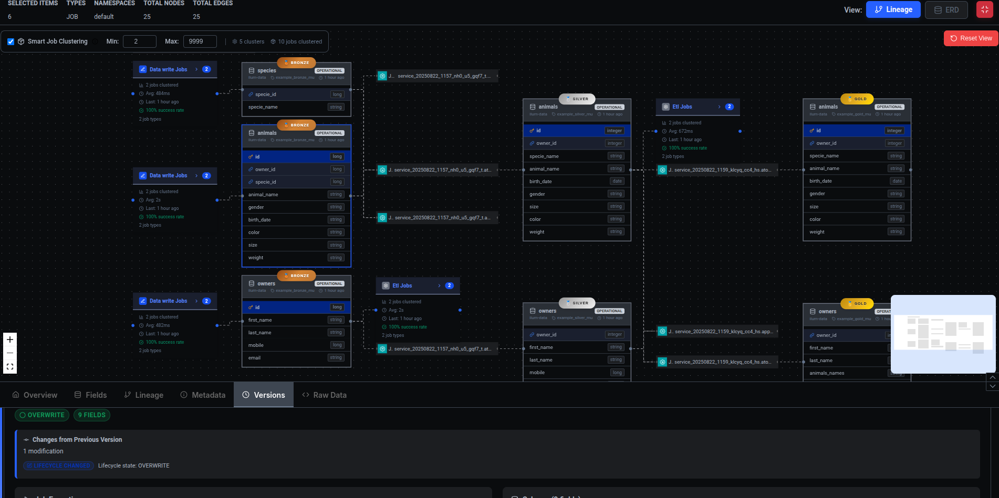

# Ilum × Marquez — Project Description & Rationale

> **TL;DR**: We were early Marquez adopters. When upstream development slowed, we temporarily forked and iterated privately to add Ilum-focused features. We've since realigned with upstream: reverted Ilum‑specific changes to maintain 100% compatibility, and contributed non‑breaking fixes and enhancements (e.g., a Search API). Starting with **Marquez 0.52.x**, we’ll upstream additional features gradually, prioritizing stability. We don’t use `marquez-web` at Ilum; we run our own UI, which we plan to open‑source.

---

  
  

  
  

---

## Why we forked (and why we came back)

* **Early adopters:** We’ve run Marquez in production for lineage and metadata at Ilum.
* **Temporary fork:** When the upstream repo felt stale, we forked to keep moving, adding features tailored to Ilum’s needs in a closed repository.
* **Upstream first, again:** We decided that the right long‑term move is community alignment. We reverted Ilum‑specific changes to ensure **100% compatibility** with the original API and data model, so every Marquez user can benefit from our **bug fixes** and **non‑intrusive enhancements** (like the Search API) without surprises.

## What’s in this distribution today

* **Drop‑in compatibility:** Same core API/schemas as upstream Marquez. We treat compatibility as a non‑negotiable.
* **Non‑breaking improvements:** Stability fixes and additive features (e.g., a Search API). Anything behavior‑changing stays out until it’s discussed upstream.
* **Ilum UI (separate):** We do **not** use `marquez-web`. We run our own web UI internally; we plan to open‑source it as a separate project.

## Roadmap & upstreaming plan

Starting with **Marquez 0.52.x**:

1. **Slow, steady upstreaming:** We’ll propose and merge Ilum features incrementally to the Marquez project, focusing on safety and backwards compatibility.
2. **Zero breakage policy:** We avoid breaking existing APIs and storage schemas. Any necessary changes will follow deprecation paths and upstream review.
3. **UI track:** Our Ilum UI will be published as a separate open‑source UI for Marquez/OpenLineage, with a focus on searchability, large‑scale lineage exploration, and operational tooling.

> We mirror upstream tags and changelogs, and we consider regression budgets first‑class. If something isn’t ready for the community, it stays behind a flag or out‑of‑tree until it is.

## Compatibility & versioning

* **API / Model:** Compatible with upstream Marquez. Additive changes only.
* **Spec alignment:** We follow OpenLineage spec compatibility as maintained by Marquez upstream.
* **Version numbers:** We track upstream releases and document any deltas explicitly.

## Frequently asked questions

**Why did you fork instead of sending PRs right away?**
Over the last six months, no PRs were merged in the Marquez repository. We had to act fast to unblock our roadmap, so we forked and shipped critical fixes and features. Now that those changes are battle‑tested, we’re realigning with upstream and contributing them back.

**Will this diverge from Marquez?**
No—our strategy is upstream‑first. We avoid long‑term divergence and aim for a thin delta that trends to zero.

**What about `marquez-web`?**
We don’t use it internally. Our separate UI will target the same APIs and is intended to be open‑sourced so the community has an alternative interface.

**How risky is it to adopt this today?**
We strive for drop‑in safety. Enhancements are additive; anything risky is gated or held back until vetted upstream.

## Contributing

We welcome issues and PRs—especially around testing, backwards compatibility, and search/graph exploration use cases. If you’re running Marquez at scale and have pain points, we’d love to collaborate.

## License

Apache‑2.0 (same as upstream Marquez). See `LICENSE`.

## Acknowledgements

Thanks to the Marquez maintainers and the OpenLineage community. The upstream‑first model is what makes this work: we’re here to help keep Marquez healthy and useful for everyone.
